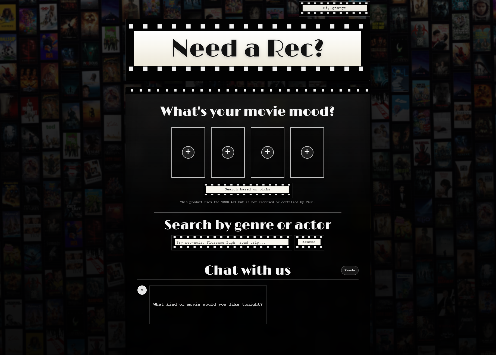
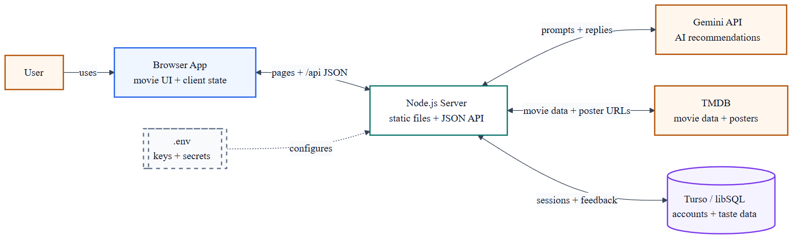
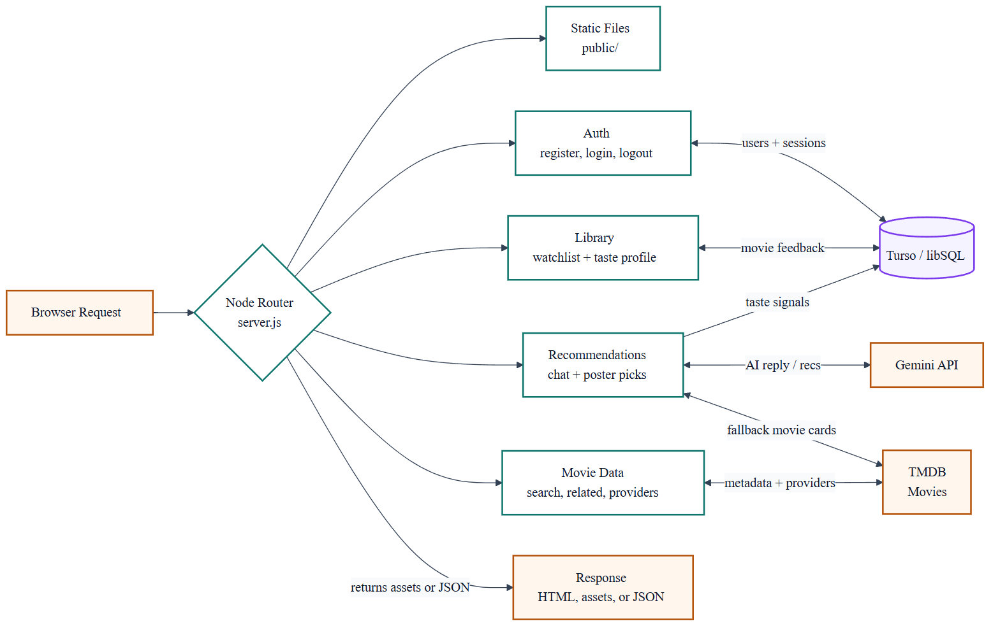
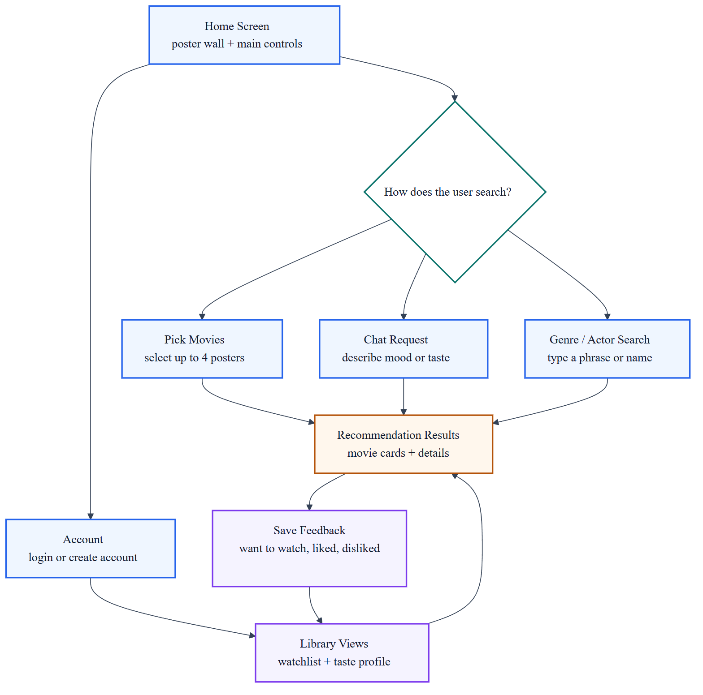

# Need A Rec?



Need a movie suggestion? This repository contains a Node.js web app that serves a theater-themed movie recommendation frontend and API routes for recommendations, search, accounts, and saved taste data.

## Overview (current state)

- Server: `src/server.js` is a custom Node HTTP server that serves `public/` and exposes API endpoints under `/api/*` for chat, movie search, recommendations, provider lookup, account auth, profiles, and movie feedback.
- Frontend: `public/` contains the static app (`index.html`, `app.js`, `styles.css`) with an animated poster wall, four-movie mood picker, genre/actor search, recommendation result details, chat UI, account modal, watch list page, taste profile modal, and feedback controls.
- AI integration: Gemini powers chat recommendations and pick-based recommendations when `GEMINI_API_KEY` is set. Pick-based recommendations are enriched with TMDB data, and TMDB-backed suggestions are used as fallback results.
- Movie data: The Movie Database (TMDB) is used for title search, genre/actor discovery, poster artwork, recommendation enrichment, trailers, animated poster-wall data, external TMDB links, and US watch-provider lookup when `TMDB_API_KEY` or `TMDB_ACCESS_TOKEN` is configured. Curated media entries cover editorial picks such as *The Long Goodbye*, and an optional YouTube Data API key adds automatically selected video essays for other titles.
- Accounts and taste data: Turso/libSQL account storage supports username/password registration, login/logout, session cookies, saved watch-list items, liked/disliked movie feedback, profile lookup, and taste-profile signals used by recommendations.

## System architecture

### Overall system



### Backend flow



### UX flow



## Features

- Chat-based movie recommendations via Gemini (when `GEMINI_API_KEY` is set).
- Pick-based recommendations from up to four selected movies, with Gemini output and TMDB fallback discovery.
- Genre and actor search backed by TMDB discovery.
- Clickable recommendation results with expanded details, poster-linked YouTube trailers, optional embedded video essays, external links, and TMDB provider lookup.
- Account modal for creating an account, logging in, and logging out when account storage is configured.
- Watch list and taste profile flows for saving movies, marking likes/dislikes, and removing saved feedback.
- Endpoints:
  - `POST /api/chat` - chat recommendations.
  - `POST /api/movies/recommendations` - pick-based recommendations.
  - `GET /api/movies/search?query=...` - TMDB title search.
  - `GET /api/movies/related?query=...` - related/discovery results.
  - `GET /api/movies/providers?movieId=...` - TMDB watch-provider lookup.
  - `GET /api/movies/media?movieId=...&title=...&year=...` - TMDB trailer and optional YouTube essay lookup.
  - `GET /api/movies/poster-wall` - poster wall data for the animated background.
  - `GET /api/auth/me` - current account session status.
  - `POST /api/auth/register` - create a basic account.
  - `POST /api/auth/login` - log in.
  - `POST /api/auth/logout` - log out.
  - `GET /api/profile` - signed-in user profile and taste data.
  - `GET /api/movies/feedback?status=...` - saved movie feedback.
  - `POST /api/movies/feedback` - create or update saved movie feedback.
  - `DELETE /api/movies/feedback` - remove saved movie feedback.

## Requirements

- Node.js 18 or newer.

## Environment variables

- `GEMINI_API_KEY` - (optional) API key for Gemini; required to enable chat recommendations.
- `GEMINI_MODEL` - (optional) Gemini model name; defaults to `gemini-2.5-flash`.
- `TMDB_API_KEY` or `TMDB_ACCESS_TOKEN` - (optional) TMDB credentials for search/posters/provider lookup.
- `YOUTUBE_API_KEY` - (optional) YouTube Data API v3 key for automatic video-essay results. Without it, the detail view links to a focused YouTube search.
- `TURSO_DATABASE_URL` and `TURSO_AUTH_TOKEN` - (optional) Turso database credentials for account storage.
- `SESSION_SECRET` - required when Turso account storage is enabled; use a long random string.
- `AUTH_INVITE_CODE` - (optional) shared code required for registration when set.
- `PORT` - (optional) server port (default: `3000`).

The server logs helpful warnings on startup if keys are missing.

## Run locally

1. Install Node.js 18+.
2. (Optional) Copy `.env.example` to `.env` and add your API keys.

```bash
npm install
```

```bash
npm start
# or
node src/server.js
```

Open http://localhost:3000.

## Where to look in the code

- Server: `src/server.js` - HTTP server, API handlers, and TMDB/Gemini/account integration points.
- Frontend: `public/index.html`, `public/app.js`, `public/styles.css`.
- Static assets: `public/assets/`.

## Notes

- Keep real API keys out of source control; use `.env`.

## License

- No license specified.
